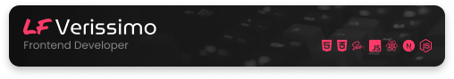

# 

### 🔧 Languages and Tools:
                   

### 💻 Projects:

  
<strong>Front-end</strong>

   
   
   
   
  

  
<strong>Fullstack</strong>

   
   
  

  
<strong>JAM Stack</strong>

   
   
   

  
<strong>Desktop</strong>

   
   
  

  
<strong>Blockchain</strong>

   
  

  
<strong>Landing page</strong>

 
 
 

